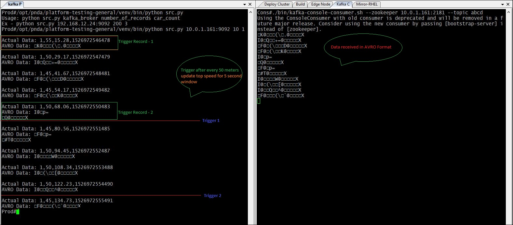
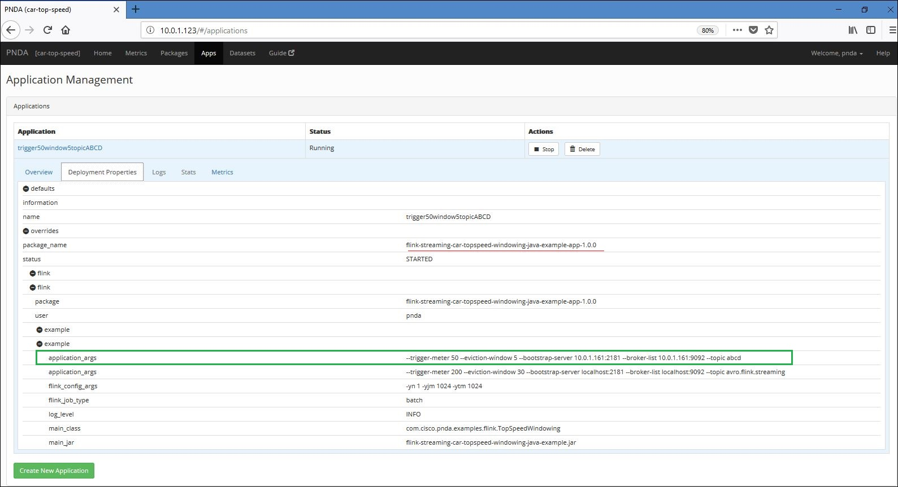
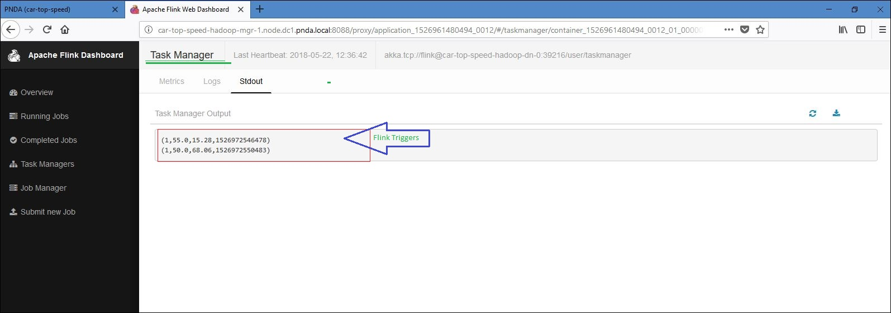

# Example Streaming Application: Car-Top-Speed-Windowing illustrating Flink windows, triggers and event processing.

The streaming example application triggers the top speed of each car every x meters elapsed for the last y seconds.

The application serves as an example to illustrate the usage of below features in the flink application -
* [Flink Java API](https://ci.apache.org/projects/flink/flink-docs-release-1.4/dev/java8.html)
* [Flink Windows](https://ci.apache.org/projects/flink/flink-docs-release-1.4/dev/stream/operators/windows.html)
* [Flink Triggers](https://ci.apache.org/projects/flink/flink-docs-release-1.4/dev/stream/operators/windows.html#triggers)
* [Flink Connectors - AVRO Support](https://ci.apache.org/projects/flink/flink-docs-release-1.4/dev/batch/connectors.html)
* [Flink Kafka Connector](https://ci.apache.org/projects/flink/flink-docs-release-1.4/dev/connectors/kafka.html)


## Overview

The example stream processing application shows an example of an application that can be deployed using the PNDA Deployment Manager. (See the `platform-deployment-manager` project for details.)
This example uses the Flink APIs. When PNDA is configured to use HDP/CDH cluster, Flink is deployed by default.

The application is a tar file containing binaries and configuration files required to perform some batch and stream processing.

Here, the source fetches events from cars every 100 milliseconds ( depends on speed of data generation by data source ) containing their id, current speed (km/h), overall elapsed distance (m) and the time stamp. 

The streaming example application triggers the top speed of each car every x (100) meters elapsed for the last y (10) seconds.

**Example:** x = 100 meters , y = 10 seconds.
Here, Flink will trigger every time the car travels 100 meters, And trigger will show the top speed of the car in last 10 seconds. 

Application consists of flink configuration arguments and application configuration arguments. 

Application configuration input parameters includes - 
- Zookeeper Server ( name: **--bootstrap-server**, default-value: **localhost:2181** )
- Kafka Server ( name: **--broker-list**, default-value: **localhost:9092** )
- Topic ( name: **--topic**, default-value: **avro.flink.streaming** ) 
- Trigger Meter ( name: **--trigger-meter**, default-value: **100** ) 
- Window Size ( name: **--eviction-window**, default-value: **10** )

Zookeeper Server, Kafka Server and Topic are the data source specifications for the example application. Whereas Trigger Meter and Eviction Window defines the data computation/processing logic. 
The example application reads data from the specified kafka topic (data is expected in AVRO Format), de-serilizes the data and performs data processing for input infinite stream. 

Application configuration output parameters includes- 
- Data sink ( name: **--output** - No default value)
The results are printed into the console output of the flink driver process by default. To view these, navigate to the log file via the Yarn Resource Manager UI ((RUNNING -> -> ApplicationMaster -> Task Managers -> stdout) or use the PNDA log server. 
If required, output can be redirected to the user specific file using --output option. This parameter is to be specified along with other application arguments.

# Flink Windows

Windows are at the heart of processing infinite streams. Windows split the stream into "buckets" of finite size, over which we can apply computations.

In this example application, source fetches events from cars containing their id, their current speed (km/h), overall elapsed distance (m) and a time stamp. 
The streaming example triggers the top speed of each car every x meters elapsed for the last y seconds.

The Advantages of using Flink here is Flink streaming processes data streams as true streams, i.e. data elements are immediately "pipelined" through a streaming program as soon as they arrive. This allows performing flexible window operations on streams.

# Flink Connectors

Connectors provide code for interfacing with various third-party systems Like Apache Kafka (source/sink), Apache Cassandra (sink), Elasticsearch (sink), Hadoop FileSystem (sink), RabbitMQ (source/sink), etc.

The Flink Kafka Consumer integrates with Flink's checkpointing mechanism to provide exactly-once processing semantics. To achieve that, Flink does not purely rely on Kafka's consumer group offset tracking, but tracks and checkpoints these offsets internally as well.

The example application demonstrates the usage of Apache Kafka Connector. This Apache kafka connector provides access to event streams served by Apache Kafka. So, Flink kafka connector reads the data written by producer in AVRO format over the kafka stream, application modules deserilizes it and performs specified computation to produce the appropriate triggers with useful information.

# Application walk-through
 
1. Data source - The sample data-source is available in the application. After building the application data-source ( tar.gz ) can be copied to data producer node and data can be generated.
   It writes data _(10 records per second)_ to specified kafka server for topic _avro.flink.streaming_ by default. The streaming speed and kafka topic can be updated if required by making changes to driver script.

   

2. Sample Application configuration -

   

3. Application output  
 
   

## Requirements

* [Maven](https://maven.apache.org/docs/3.0.5/release-notes.html) 3.0.5
* [Java JDK](https://docs.oracle.com/javase/8/docs/technotes/guides/install/install_overview.html) 1.8

## Build
Edit the `batch-processing-app/pom.xml` file with the correct dependencies.

To build the example applications use:

````
mvn clean package
````

This command should be run at the root of the repository and will build the application package. It will create a package file `flink-streaming-car-topspeed-windowing-java-example-app-{version}.tar.gz` in the `app-package/target` directory.

It will also create `data-source-1.0.0.tar.gz` in in the `data-source/target` directory. This can be used as a sample data source.

## Files in the package

- `application.properties`: config file used by the Flink Streaming java application.
- `properties.json`: contains default properties that may be overridden at application creation time.

## Deploying the package and creating an application

The PNDA console can be used to deploy the application package to a cluster and then to create an application instance. The console is available on port 80 on the edge node.

To make the package available for deployment it must be uploaded to a package repository. The default implementation is an OpenStack Swift container. The package may be uploaded via the PNDA repository manager which abstracts the container used, or by manually uploading the package to the container.
